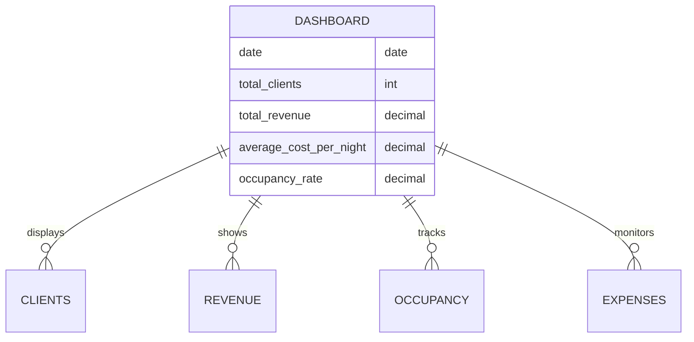
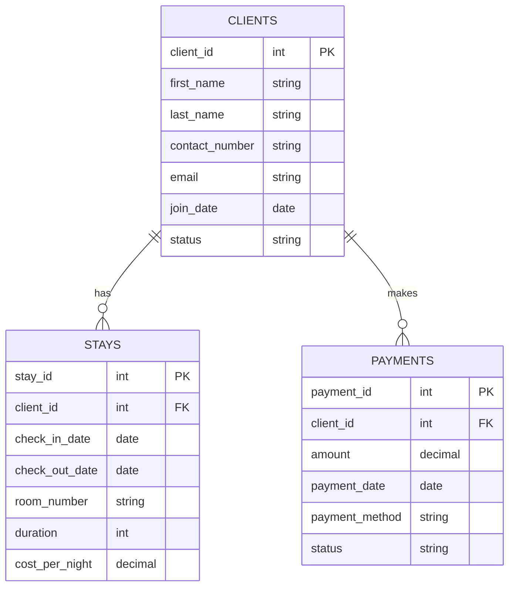
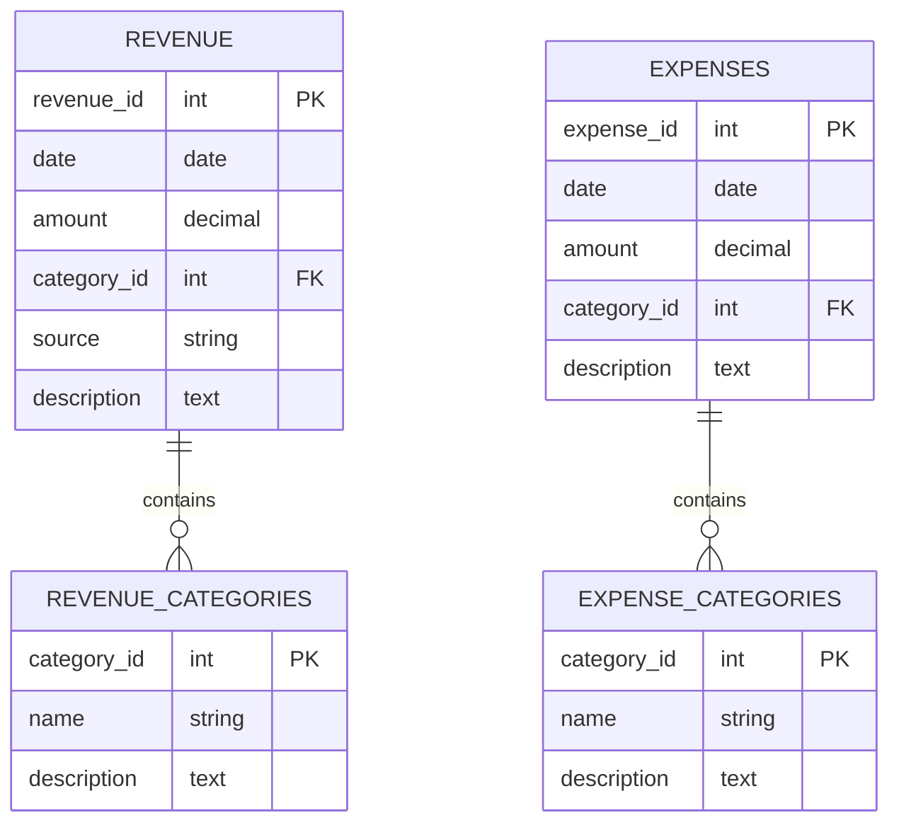
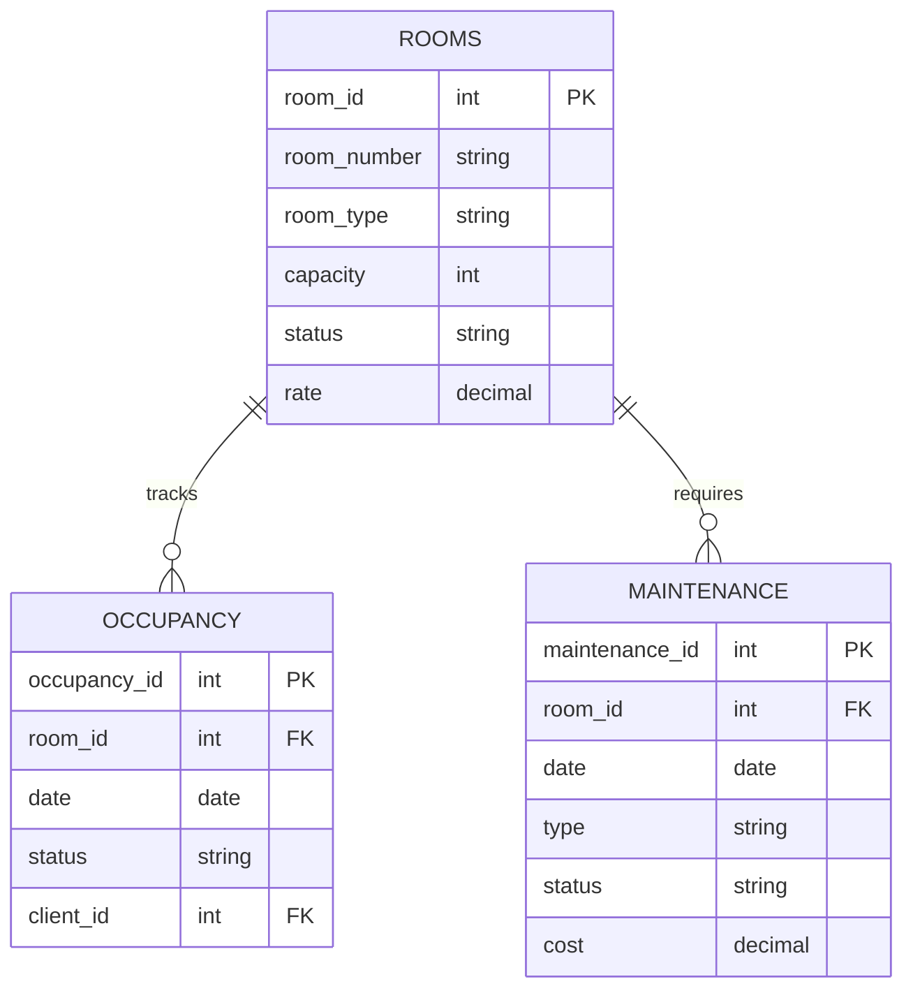
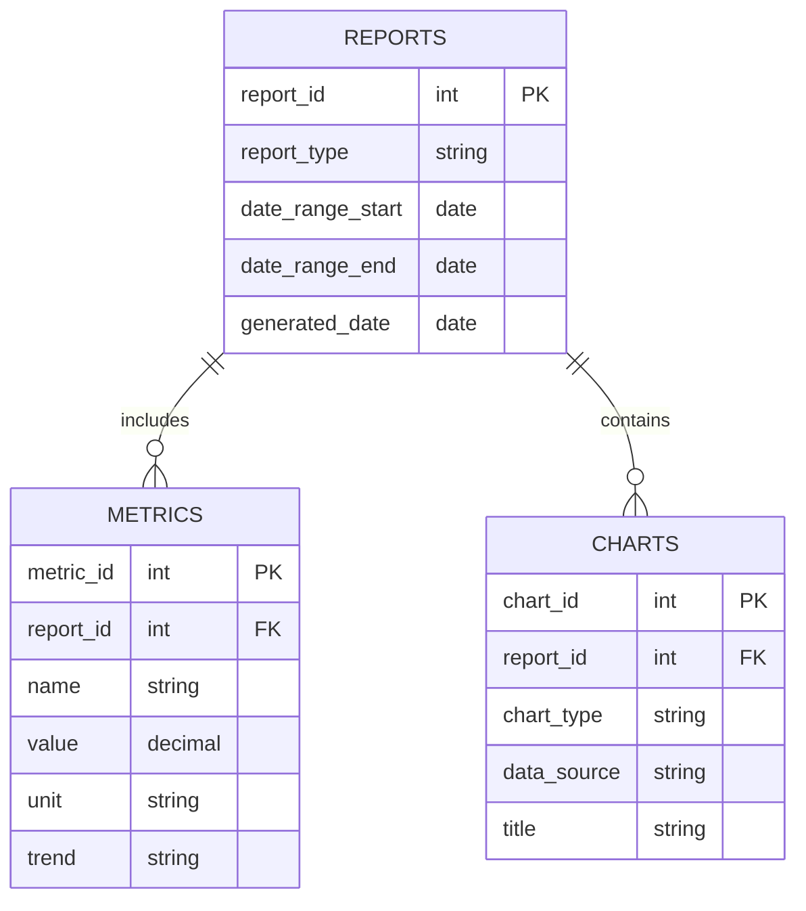
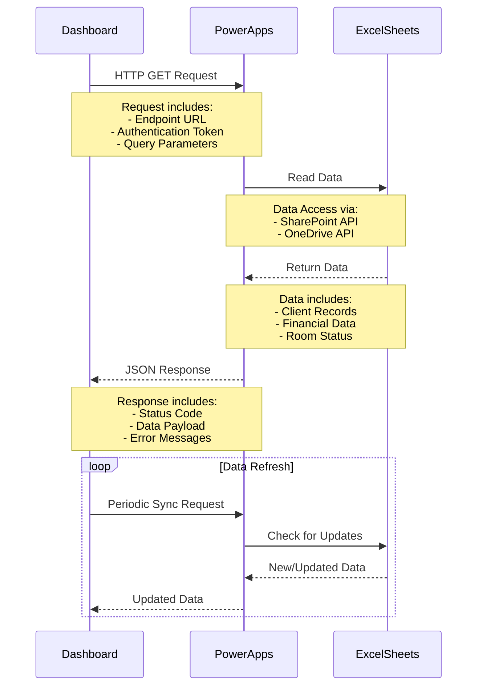
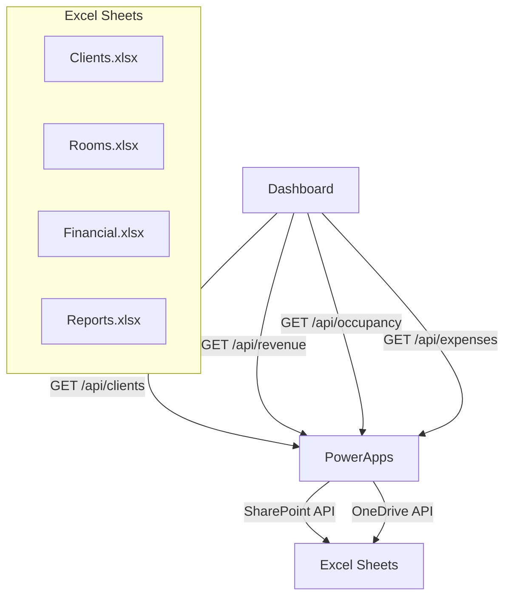
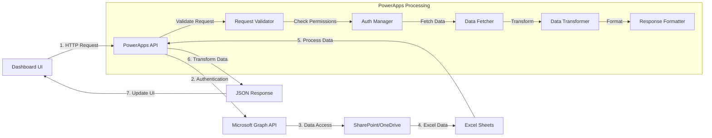

# JH Dashboard - Entity Relationship Diagrams

## 1. Main Dashboard Data Structure


## 2. Client Data Structure


## 3. Revenue and Expenses Structure


## 4. Occupancy and Room Management


## 5. Reporting and Analytics Structure


## 6. Data Flow Architecture


## 7. API Endpoints Structure


## 8. Data Synchronization Flow


## API Integration Details

### 1. Dashboard to PowerApps Connection
```javascript
// Example API Request Structure
{
    endpoint: "https://api.powerapps.com/v1.0/...",
    method: "GET",
    headers: {
        "Authorization": "Bearer {token}",
        "Content-Type": "application/json"
    },
    params: {
        sheet: "Clients",
        dateRange: {
            start: "2024-01-01",
            end: "2024-03-31"
        }
    }
}
```

### 2. PowerApps to Excel Connection
```javascript
// Example Data Access Flow
1. PowerApps receives request
2. Validates authentication token
3. Connects to SharePoint/OneDrive
4. Accesses specific Excel file
5. Reads relevant worksheet
6. Processes and transforms data
7. Returns JSON response
```

### 3. Data Refresh Mechanism
```javascript
// Example Refresh Configuration
{
    refreshInterval: 300000, // 5 minutes
    sheets: [
        {
            name: "Clients",
            lastSync: "2024-03-20T10:00:00Z",
            nextSync: "2024-03-20T10:05:00Z"
        },
        {
            name: "Financial",
            lastSync: "2024-03-20T10:00:00Z",
            nextSync: "2024-03-20T10:05:00Z"
        }
    ]
}
```

### 4. Error Handling
```javascript
// Example Error Response
{
    status: "error",
    code: 500,
    message: "Failed to fetch data",
    details: {
        source: "Excel Sheet",
        error: "Connection timeout",
        timestamp: "2024-03-20T10:00:00Z"
    }
}
```

## Security Considerations
1. **Authentication**
   - OAuth 2.0 token validation
   - Role-based access control
   - Token expiration handling

2. **Data Protection**
   - HTTPS encryption
   - Data validation
   - Input sanitization

3. **Error Handling**
   - Graceful degradation
   - Error logging
   - User notifications

4. **Performance**
   - Caching strategy
   - Request batching
   - Data compression

## Excel Sheet Structure
The above ERDs correspond to the following Excel sheets that would be needed:

1. **Clients Sheet**
   - Client Information
   - Stay Records
   - Payment History

2. **Rooms Sheet**
   - Room Details
   - Occupancy Status
   - Maintenance Records

3. **Financial Sheet**
   - Revenue Records
   - Expense Records
   - Category Definitions

4. **Reports Sheet**
   - Daily/Monthly Reports
   - Key Metrics
   - Chart Configurations

## PowerApps Integration Points
1. **Data Sources**
   - SharePoint/OneDrive Excel files
   - Real-time data connections
   - Scheduled data refreshes

2. **Data Flow**
   - Excel → PowerApps → Dashboard
   - Automated data synchronization
   - Error handling and validation

3. **Security**
   - Access control
   - Data validation
   - Audit logging 