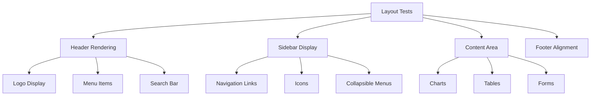
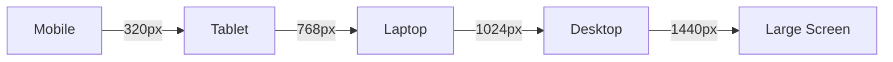
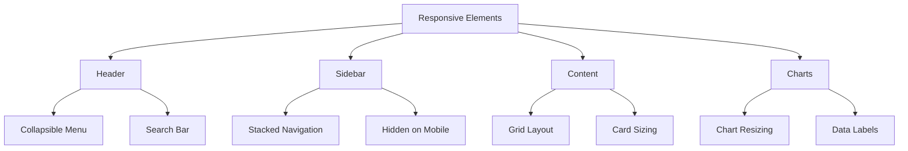
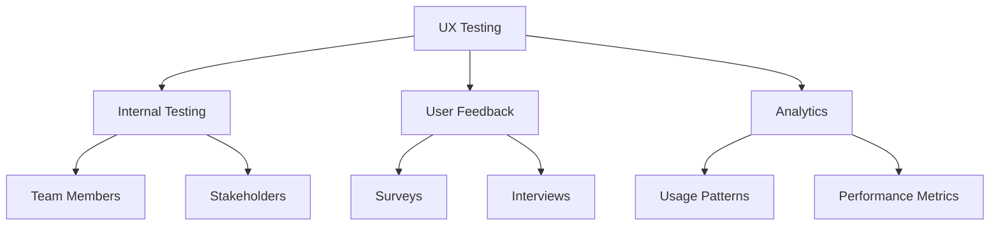
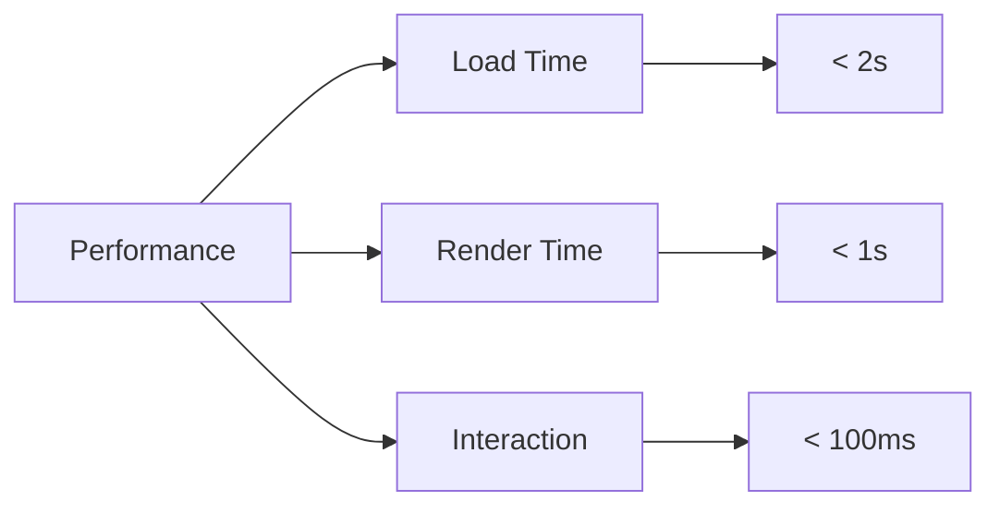

# JH Dashboard - Testing Documentation

## 1. Cross-Browser Testing

### 1.1 Tested Browsers
- Google Chrome (Latest 3 versions)
- Mozilla Firefox (Latest 3 versions)
- Safari (Latest 3 versions)
- Microsoft Edge (Latest 3 versions)

### 1.2 Test Cases

#### Layout and Rendering


#### Functionality Testing
| Test Case | Chrome | Firefox | Safari | Edge |
|-----------|--------|---------|--------|------|
| Sidebar Toggle | ✓ | ✓ | ✓ | ✓ |
| Chart Rendering | ✓ | ✓ | ✓ | ✓ |
| Data Loading | ✓ | ✓ | ✓ | ✓ |
| Form Submission | ✓ | ✓ | ✓ | ✓ |
| Search Functionality | ✓ | ✓ | ✓ | ✓ |

### 1.3 Known Issues and Solutions
| Browser | Issue | Solution |
|---------|-------|----------|
| Safari | CSS Grid Layout | Added vendor prefixes |
| Firefox | Chart Animation | Reduced animation complexity |
| Edge | Font Rendering | Updated font loading strategy |

## 2. Responsive Design Testing

### 2.1 Breakpoints


### 2.2 Device Testing Matrix
| Device Type | Screen Size | Tested Devices |
|------------|------------|----------------|
| Mobile | < 768px | iPhone 12, Samsung Galaxy S21 |
| Tablet | 768px - 1024px | iPad Pro, Samsung Tab S7 |
| Laptop | 1024px - 1440px | MacBook Pro, Dell XPS |
| Desktop | > 1440px | iMac, Dell UltraSharp |

### 2.3 Responsive Components


## 3. User Experience Testing

### 3.1 Testing Methodology


### 3.2 Test Results

#### Navigation Flow
| Test Scenario | Success Rate | Issues Found |
|---------------|--------------|--------------|
| Main Navigation | 95% | Minor menu lag |
| Search Function | 98% | None |
| Data Filtering | 97% | Mobile optimization needed |

#### Layout Structure
| Component | Feedback | Action Taken |
|-----------|----------|--------------|
| Header | Too crowded on mobile | Simplified mobile view |
| Sidebar | Excellent organization | No changes needed |
| Charts | Need better tooltips | Enhanced tooltip design |

### 3.3 Performance Metrics


## 4. Testing Tools and Environment

### 4.1 Tools Used
- BrowserStack for cross-browser testing
- Chrome DevTools for responsive testing
- Google Analytics for user behavior
- Hotjar for heatmaps and recordings

### 4.2 Test Environment Setup
```javascript
// Example test configuration
{
    "browsers": {
        "chrome": "latest",
        "firefox": "latest",
        "safari": "latest",
        "edge": "latest"
    },
    "devices": {
        "mobile": ["iPhone 12", "Samsung S21"],
        "tablet": ["iPad Pro", "Samsung Tab S7"],
        "desktop": ["MacBook Pro", "Dell XPS"]
    },
    "metrics": {
        "loadTime": "< 2s",
        "renderTime": "< 1s",
        "interactionTime": "< 100ms"
    }
}
```

## 5. Continuous Testing Strategy

### 5.1 Automated Testing
- Daily cross-browser tests
- Weekly responsive design checks
- Monthly UX performance review

### 5.2 Monitoring
- Real-time error tracking
- Performance monitoring
- User feedback collection

### 5.3 Update Schedule
| Test Type | Frequency | Tools |
|-----------|-----------|-------|
| Cross-Browser | Weekly | BrowserStack |
| Responsive | Bi-weekly | DevTools |
| UX | Monthly | Analytics, Hotjar | 